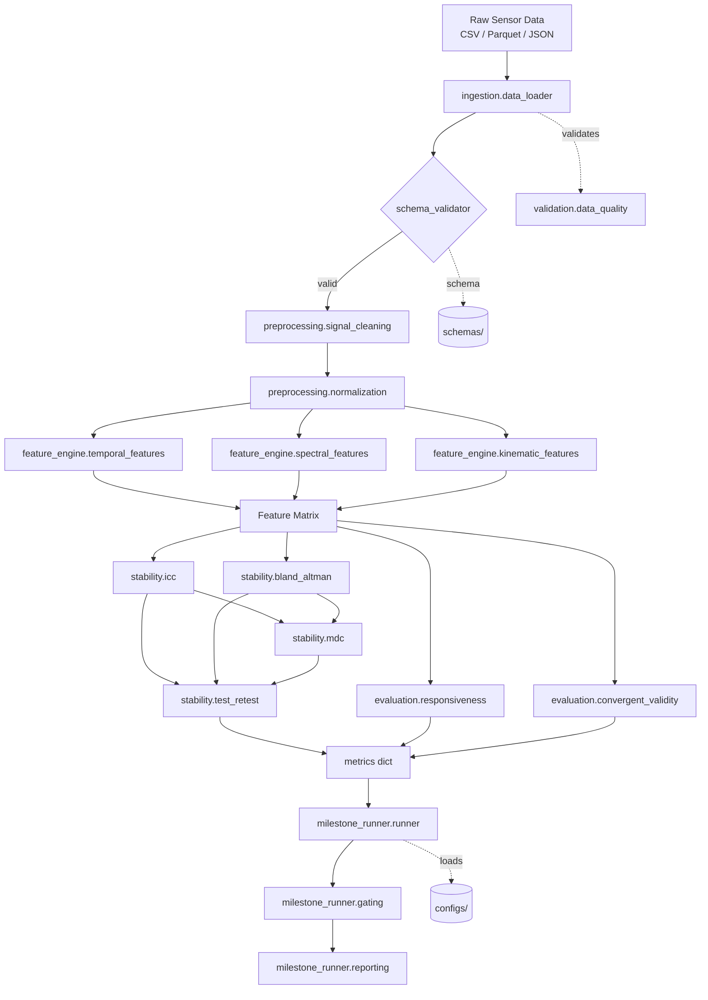

# Architecture Overview -- gnf-core-foundry

## Introduction

gnf-core-foundry is the canonical digital biomarker processing pipeline for the Global NeuroFoundry translational neuroscience platform. It is designed around five principles:

1. **Rigour** -- all statistical methods are gold-standard (R/irr ICC, publication-quality Bland-Altman)
2. **Transparency** -- complete evidence trails for all gating decisions
3. **Reproducibility** -- schema-validated data, versioned configs, and deterministic algorithms
4. **Modularity** -- each module is independently importable and testable
5. **Auditability** -- JSON + Markdown reports for every milestone evaluation

---

## Module Dependency Graph

---

## Module Descriptions

### `stability.icc`

All 6 ICC forms (Shrout & Fleiss 1979):

| Form | Model | Unit | Use |
|------|-------|------|-----|
| ICC(1,1) | One-way random | Single | Single consistent rater |
| ICC(2,1) | Two-way random | Single | Each subject rated by each rater |
| ICC(3,1) | Two-way mixed | Single | Fixed raters, consistency |
| ICC(1,k) | One-way random | Average | Average of k raters |
| ICC(2,k) | Two-way random | Average | Most common for test-retest |
| ICC(3,k) | Two-way mixed | Average | Fixed raters, average |

**Primary backend:** R `irr::icc()` via rpy2. **Fallback:** `pingouin.intraclass_corr`.

---

### `stability.bland_altman`

Full Bland-Altman implementation:
- Bias (mean difference) with CI
- Limits of Agreement (+/-1.96 SD) with CI
- Proportional bias test (OLS regression)
- Repeated-measures variant
- Publication-quality matplotlib plots

---

### `milestone_runner`

YAML-driven gating engine:
1. Load `configs/r21_template.yaml` or `configs/r33_template.yaml`
2. Parse milestone definitions into `GatingCriterion` objects
3. Evaluate each criterion against the `metrics` dict
4. Apply AND/OR gate logic (critical criteria always fail-fast)
5. Build `GateResult` with evidence trail
6. Generate `MilestoneReport` as JSON + Markdown

**CLI:** `gnf-run-milestone --config configs/r21_template.yaml --metrics metrics.json`

---

### `api.endpoints`

FastAPI REST API:
- `POST /compute-icc` -- ICC computation
- `POST /bland-altman` -- Bland-Altman analysis
- `POST /run-milestone` -- Milestone evaluation
- `GET /health` -- Health check
